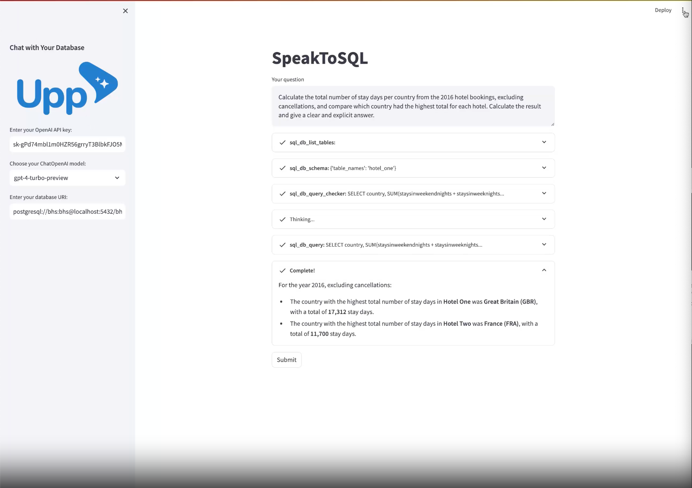

# SpeakToSQL: A Streamlit Web App for Database Interaction via OpenAI

## Overview

SpeakToSQL is a web application designed to facilitate direct communication with your database using natural language. Powered by the innovative LangChain SQL Agent and OpenAI's powerful language models, this app provides a user-friendly interface to interact with your data without writing complex SQL queries. Whether you're a database administrator, a data analyst, or just curious about interacting with databases in a new way, SpeakToSQL streamlines the process, making database queries as simple as having a conversation.

## Demo

Check out the deployed version of SpeakToSQL here: [https://upp-agency-speaktosql.streamlit.app/](https://upp-agency-speaktosql.streamlit.app/)

For a video demonstration, watch our overview on Vimeo: [Vimeo Video Link](https://vimeo.com/928296069)



## Features

- **Natural Language Queries**: Use plain English to query your database.
- **Flexible Database Support**: Connect to any SQL database by providing the database URI.
- **Powered by OpenAI**: Utilizes OpenAI's language models for understanding and generating SQL queries.
- **Streamlit Integration**: A sleek, user-friendly interface built with Streamlit, making it easy to use and deploy.

## Installation

To run SpeakToSQL locally, follow these steps:

### Prerequisites

- Python 3.11 or newer
- An OpenAI API key
- Access to a SQL database

### Steps

1. **Clone the repository**
```bash   
git clone https://github.com/dragutin-oreski/SpeakToSQL.git
cd speaktosql
```

1. **Install the required packages**
```bash
pip install -r requirements.txt
```

1. **Run the Streamlit application**
```bash
streamlit run speak_to_sql.py
```

Now, the SpeakToSQL app should be running locally on your machine. Visit the URL provided by Streamlit in your terminal to interact with the app.

## Usage

1. **Enter your OpenAI API key**: Required for making queries.
2. **Choose your ChatOpenAI model**: Select between available models.
3. **Enter your database URI**: Provide the URI to connect to your database.
4. **Ask a question**: Input your query in natural language and submit.

The app will process your input and execute the corresponding SQL query on your database, displaying the results directly within the app.

## License

This project is licensed under the MIT License - see the [LICENSE](LICENSE) file for details.

---

We hope SpeakToSQL makes your data interaction tasks easier and more intuitive. Your feedback and contributions are welcome!
